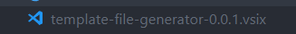
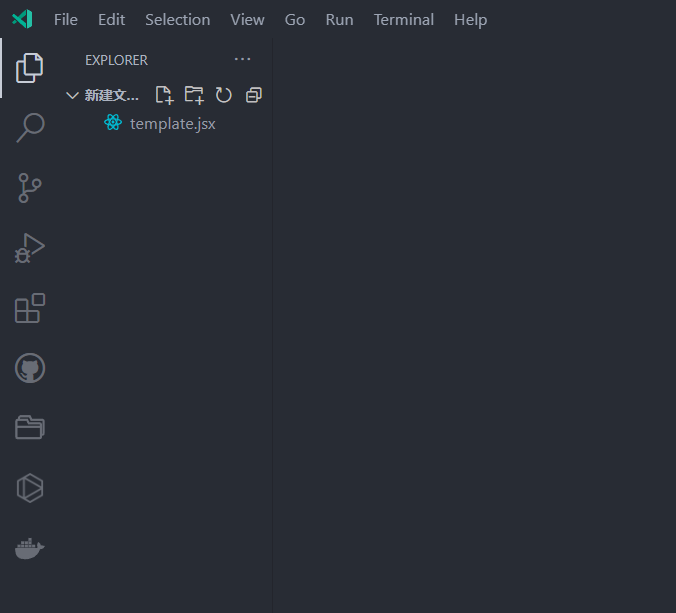

# template-file-generator README

[English](./README.md) | [简体中文](./README_zh.md)

This extension is for generating template file.

## Package the extension source code

1. Execute following commands in the terminal.

   1. `npm install -g vsce`
   2. `cd template-file-generator`
   3. `vsce package --baseContentUrl <your repo site>`

Then there will be a file named `template-file-generator-0.0.1.vsix` in your project directory as the following picture shows.

2. Open the extensions section, install from vsix. Select `template-file-generator-0.0.1.vsix` then you will install this extension successfully.

## Features

create a template file in a folder.

> Tip: Many popular extensions utilize animations. This is an excellent way to show off your extension! We recommend short, focused animations that are easy to follow.

## Requirements

Installed this extension

<!-- ## Extension Settings

Include if your extension adds any VS Code settings through the `contributes.configuration` extension point.

For example:

This extension contributes the following settings:

* `myExtension.enable`: enable/disable this extension
* `myExtension.thing`: set to `blah` to do something -->

<!-- ## Known Issues

Calling out known issues can help limit users opening duplicate issues against your extension. -->

## Release Notes

<!-- Users appreciate release notes as you update your extension. -->
If you would like to install packaged extension, please turn in to the Release Page.

### 0.0.1

Initial release of this extension in 2022.06.11

<!-- ### 1.0.1

Fixed issue #.

### 1.1.0

Added features X, Y, and Z.

----------------------------------------------------------------------------------------------------------- -->

<!-- ## Working with Markdown

**Note:** You can author your README using Visual Studio Code.  Here are some useful editor keyboard shortcuts:

* Split the editor (`Cmd+\` on macOS or `Ctrl+\` on Windows and Linux)
* Toggle preview (`Shift+CMD+V` on macOS or `Shift+Ctrl+V` on Windows and Linux)
* Press `Ctrl+Space` (Windows, Linux) or `Cmd+Space` (macOS) to see a list of Markdown snippets

### For more information

* [Visual Studio Code's Markdown Support](http://code.visualstudio.com/docs/languages/markdown)
* [Markdown Syntax Reference](https://help.github.com/articles/markdown-basics/)

**Enjoy!** -->
