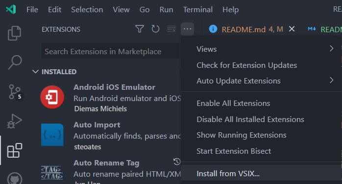
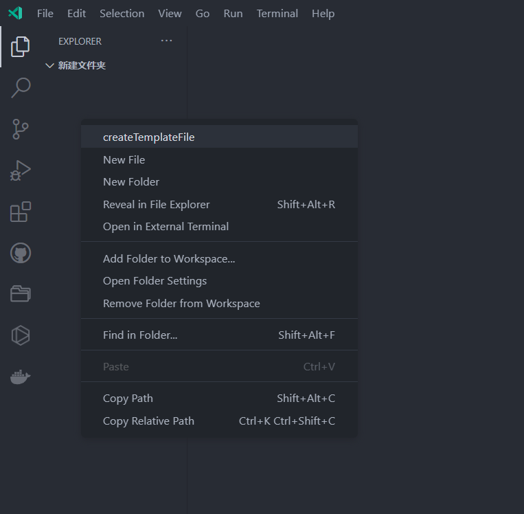
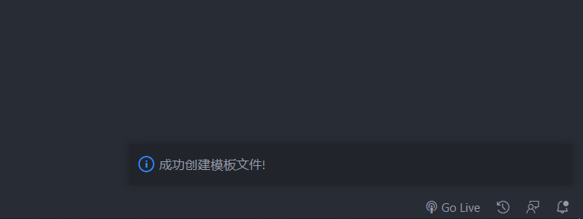
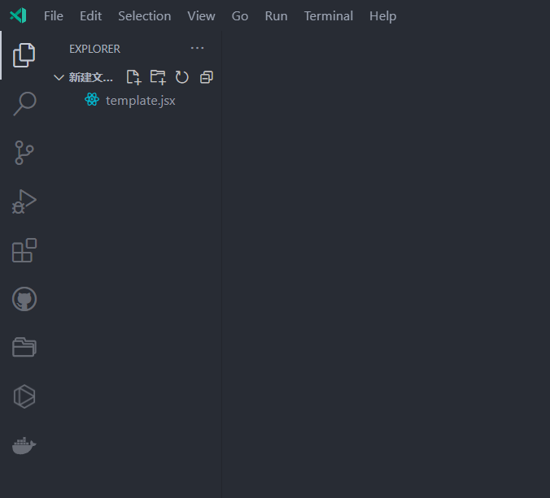

# template-file-generator README

[英文](./README.md) | [中文](./README_zh.md)

该拓展用于生成模板文件.

## 从源码打包

1. 在终端里执行下列命令.

   1. `npm install -g vsce`
   2. `cd template-file-generator`
   3. `vsce package --baseContentUrl <your repo site>`

执行完毕将会在项目文件夹下生成一个名为 `template-file-generator-0.0.1.vsix` 的文件，如下图所示.

2. 打开拓展区域, 选择从 VSIX 安装, 选择上文打包好的拓展, 进行安装.

## 特性

在一个文件夹目录下右击点击 `createTemplateFile` 命令.

## 前提

安装拓展

## 发行记录

如果你想安装打包好的拓展, 请转到 `Release` 页面.

### 1.0.0

2022.06.11 初始化发行版本.